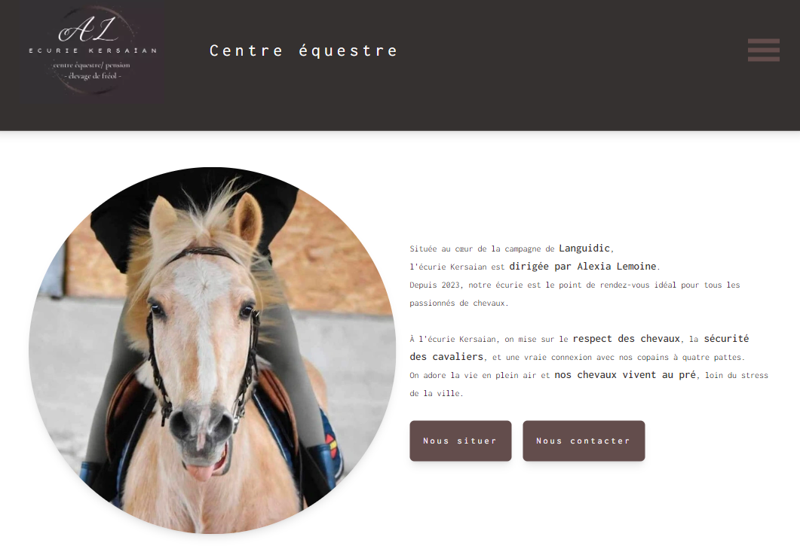

# Ecurie Kersaïan

## Développement d'un site vitrine avec une page d'administration

### 📚 Contexte

**L'écurie Kersaïan** vient de commencer son activité et souhaite un site où les visiteurs pourront consulter les informations (installations, cavalerie, plannings, tarifs, etc).  
En tant que freelance, j'ai été contactée par la gérante pour mettre en place la solution adéquate. 
Le site comporte deux pages principales et une page d'administration :

<ul>
<li>une page pour le centre équestre</li>
<li>une page pour la pension</li>
<li>une page pour administrer le centre équestre (plannings et tarifs) et la pension (formules et tarifs)</li>
</ul>

### 💡 Technologies et modèles

HTML5  
Tailwind CSS  
ReactJS  
Vue.js  
Firebase (firestore, hosting, authentication)  

Voir le site : ( [écurie Kersaïan](https://ecuriekersaian.fr/) )
